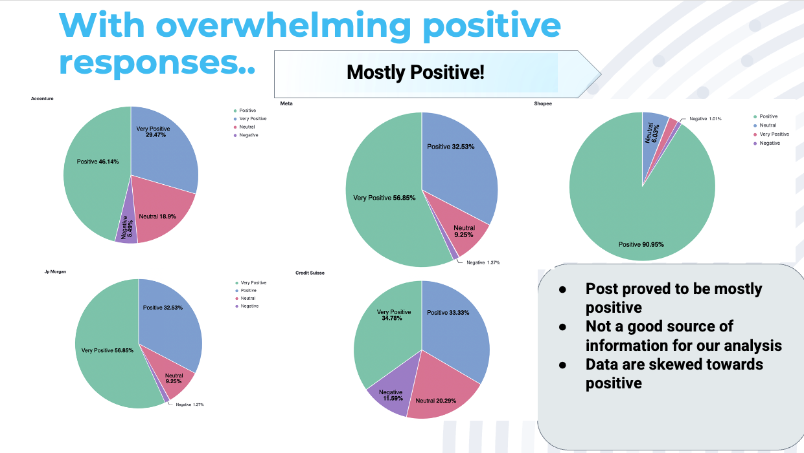
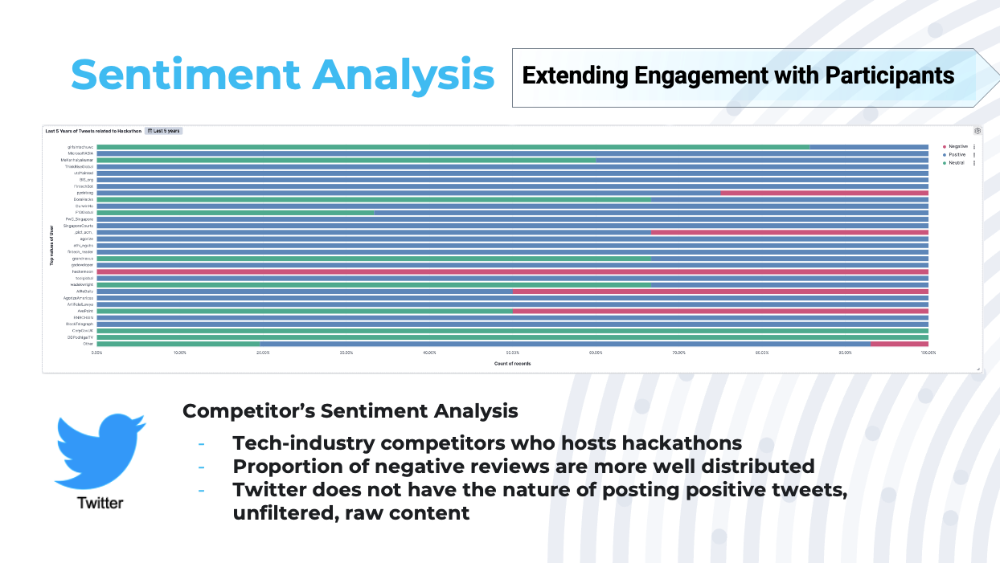
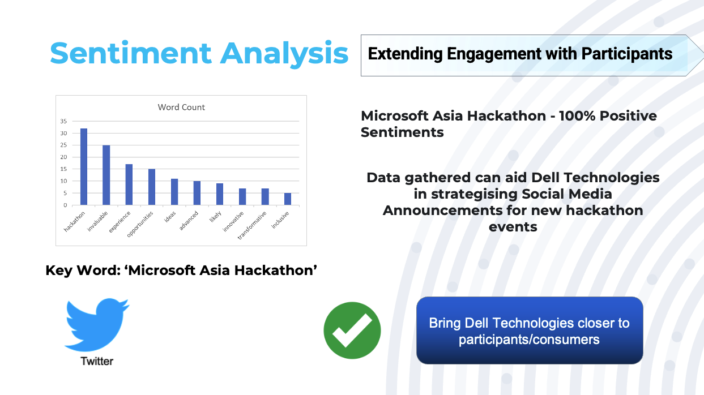
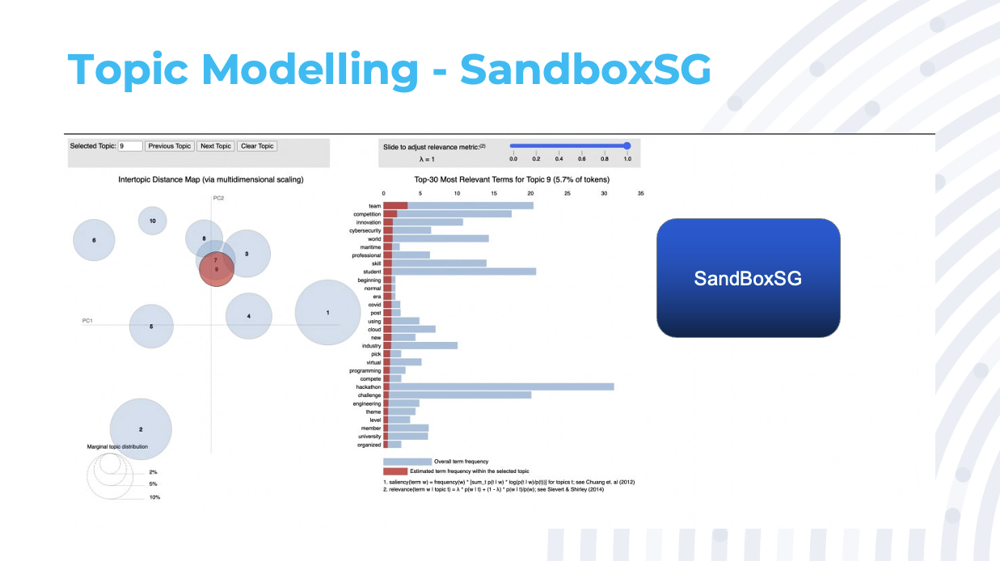
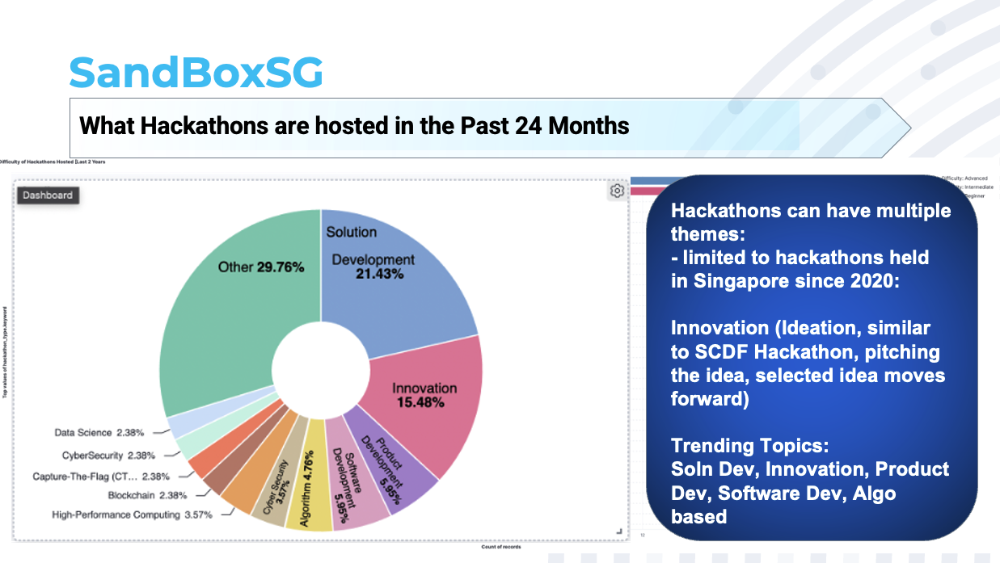
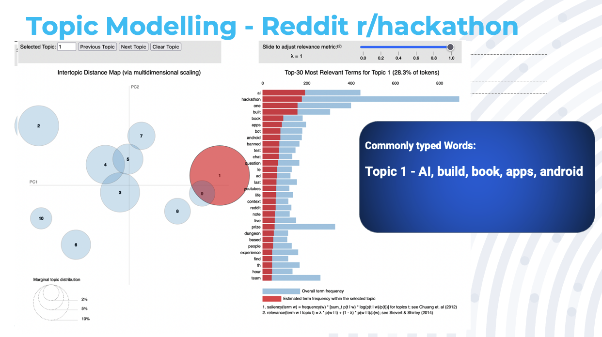
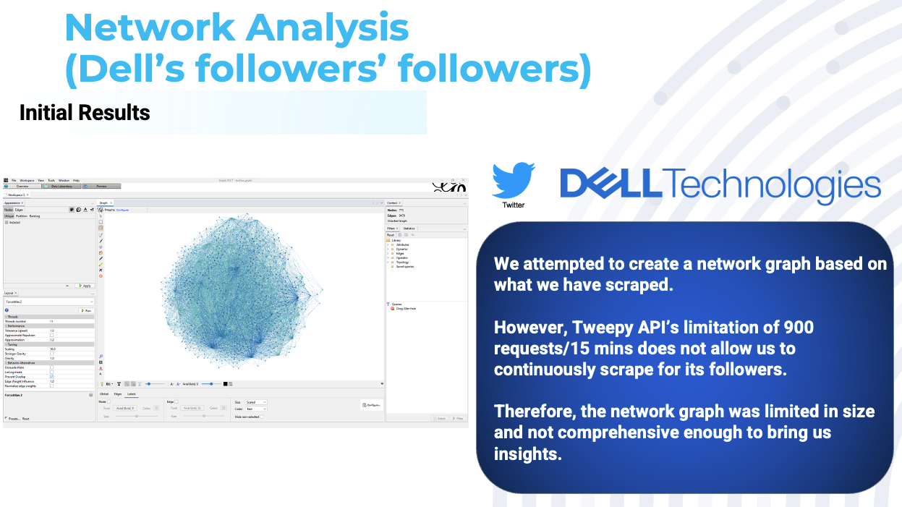
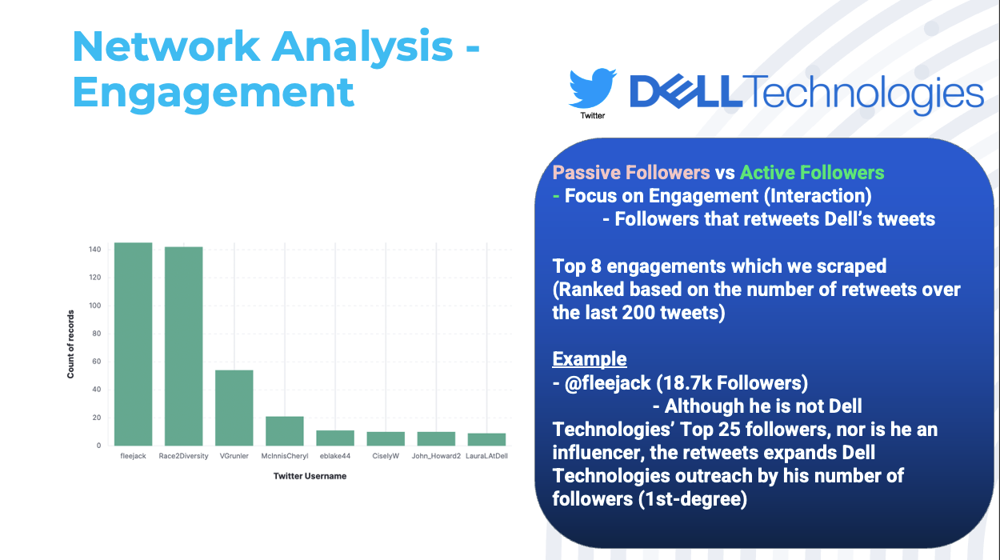
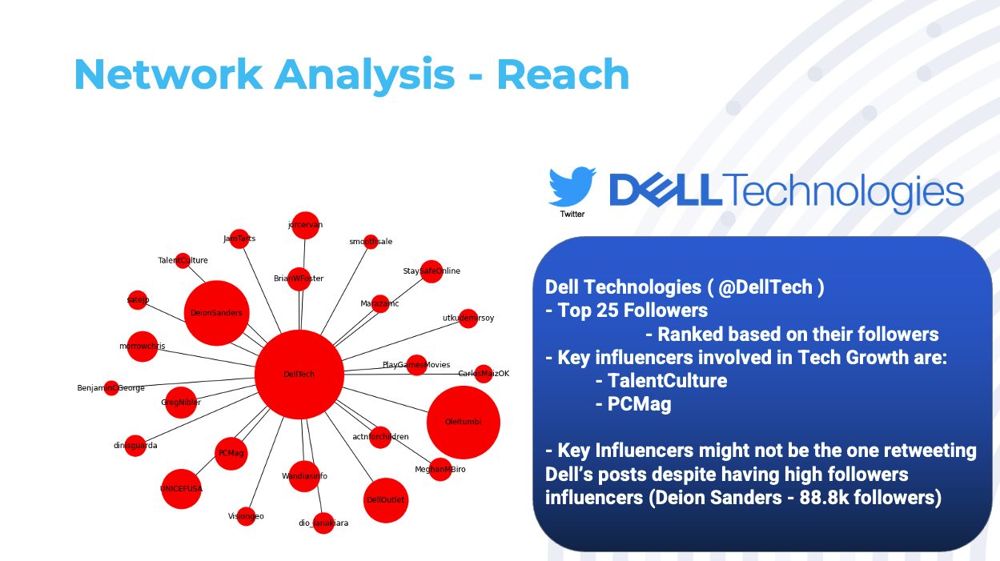

# Social Analytics with Dell

## Problem Statement
How to improve the quantity and quality of participants for future hackathons?
* Ideas across participants were similar
* Low Sign-up rates
* Uncertain about the hackathon scope / deliverables

## Solution
Recommending the best-fit solution that aims to support Dell Technologies future hackathons with their partners to help nurture the next generation of talents, increase Dell Technologies market share in the Cloud industry through sentiment analysis, topic modelling and network analysis.

## Websties Scraped
* Linkedin
* Twitter
* Reddit
* DevPost
* SandBoxSG

## Tools & Libraries used
* Python
* NLTK
* Selenium
* SNScrape
* Tweepy
* praw
* Pandas
* vaderSentiment
* Gensim
* pickle
* networkx
* pyplot
* Gephi
* Kibana

## Analysis
The following snippets highlight key findings. To delve deeper into the details, feel free to click here and access the full presentation.
* [Proposal](https://docs.google.com/presentation/d/1zvNkAOKo1AaxOO0455BLSPX-qE57yk7I/edit#slide=id.p1)
* [Final Presentation](https://docs.google.com/presentation/d/1AfH4GTvxtGAJP8XR2UF6pf4p9_vLH_RV/edit#slide=id.p1)
### 1. Sentiment Analysis Findings:

### 2. Topic Modelling Findings:

### 3. Network Analysis Findings:

